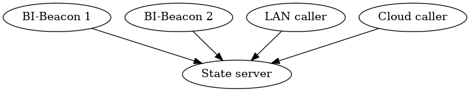

.. all documentation in one page for now

BI-Beacon Overview
==================

.. image:: https://api.travis-ci.org/objarni/leanmodel.svg?branch=master

BI-Beacons use a RESTful API.

There is only one end-point: ``/<systemid>``.

This endpoint serves as the controlling mechanism for
*system* with ID `systemid`.

A complete endpoint URL may look something like this:

   ``https://beacon-api.abcbusiness.com/my-super-monitor``

Multiple beacons can be configured to  use the same systemid - this is
intentional and means you can deploy several Beacons that indicate the
same thing.

This functionality  may, for  instance, be used  if you  have multiple
offices, or if  you want a Beacon  both in the conference  room and at
the coffee machine.

Architecture
============

BI-Beacon 1 and 2
    This is either physical or virtual BI-Beacon devices, showing some state of something interesting to your business.

State Server
    This is the source of state for BI-Beacons.

Controlling system
    This is the user of the Beacons - where API calls originate.

Background
----------

The BI-Beacon architecture is fairly straightforward, however, might need
some explanation anyway since it is not the simplest of possible
designs and this is intentional.

So let's begin with the simplest possible design and work our
way from there.

Idea 1: direct cable connections
~~~~~~~~~~~~~~~~~~~~~~~~~~~~~~~~

If we want to control devices in our offices, the simplest possible
idea would be to connect them directly to our computers.

Indeed, this  is possible  with a  BI-Beacon, using  a USB  data cable
connected  to a  wall-powered  PC, but  since  it requires  USB-serial
device drivers, as well as the right user/device permissions on the PC
in question, this  would actually be harder to do  than using the REST
API over WiFi!

This method also has the drawback of limiting the location of a Beacon
to the  vicinity of a  PC. Also,  the software controlling  the Beacon
would need to be on that PC.

Idea 2: dynamic IP addresses
~~~~~~~~~~~~~~~~~~~~~~~~~~~~

The next natural step after direct connection to a PC would be
to connect over the local network - be it over WiFi or an ethernet cable,
giving the device a local IP.

So why not use this method?

Well, the reason is corporate IT networks; they're a mess in general!

Getting a  dynamic IP  by connecting  a device to  the network  is one
thing; DHCP  is common enough  today that  it can be  generally relied
upon, however,  what then?  If you  want to  communicate to  a (local)
device connected to  the (local) network, you would need  to know its'
dynamic IP address.

At home, you could just login to your router (at least if your tech
savvy enough!) and find the IP-address of the Beacon.

But  at work,  unless you're  working in  the IT  department, that  is
typically out  of the question,  not only for "security  reasons", but
also due to that the IT  department most likely already have enough on
their hands! And  getting them to configure a device  to have a static
IP is just ..  many weeks of delivery time - time none  of us has, nor
want to put into getting a BI-Beacon up and running.

A drawback of this method is also the 'local' part - we cannot
control a BI-Beacon unless we're on the same network. Forget about
controlling it from the cloud!

Idea 3: IoT to the rescue!
~~~~~~~~~~~~~~~~~~~~~~~~~~

So, as odd as it sounds, it is actually easier to make the device
an internet-global device instead of a local (direct cable, or
local network) device!

The trick is to have the  Beacons retrieve their respective state from
a known  server (corporate  internal or  otherwise), via  secure HTTPs
requests.

This  means the  devices  can get  their  dynamic, local  IP-addresses
inside of your  fine and dandy corporate network and  you address them
indirectly  by  communicating with  the  state  server, which  resides
either inside your corporate network  (at a well-known address) or via
the public internet!

As an integrator or user of Bi-Beacons, all you have to do is send off
HTTPs requests  to the state  server (or  "API server" if  you prefer)
which stores the  states and serves them to Beacons  asking what state
to switch to.

It Just Works™! :)

API
===

BI-Beacons are controlled  via a RESTful web API,  but only indirectly
via a state  server (see Architecture_). This means it  is possible to
control Beacons from any programming language that can make HTTPs POST
requests.

You configure a Beacon to continuously copy the state of a certain
system identifier, or systemid for short. A systemid is made up of at
least one character. Allowed characters classes are small and big
english letters, digits, underscore and dash, or put in regex form:

        ``[a-zA-Z0-9_-]+``

A systemid can be up to 255 characters long.

Several Beacons may use the same system identifier; they will then
show the same state.

*Note:* The systemid can be viewed as the access key of the Beacon,
as it is all that is needed to control a device. So make sure you
only share the systemid with those persons and systems that should
be able to control the device. Do not store it publicly unless you
want anyone to be able to change the state of your Beacon.

If you want to add some security, randomize a string of at least 30
letters and numbers and use that as the system identifier.

A system can be in one of two states:

+---------+--------------------------------------------------------+
| State   |  Meaning                                               |
+=========+========================================================+
| static  | BI-Beacon will show a constant color                   |
+---------+--------------------------------------------------------+
| pulsing | BI-Beacons will pulse with a given speed and color     |
+---------+--------------------------------------------------------+

*Static colors* give the impression of the state of a system or process,
e.g. on or off, ready or failed.

*Pulsing colors* give the impression of something happening, e.g.
something is building or being processed.

The significance of individual colors and pulses is up to your imagination.

Change state
------------

:URL:       ``https://:beacon-server/:systemid/``

:Method:    POST

:Parameters:

    {
      **color:** color specification (format "#RRGGBB")

      **period:** length of the pulse in milliseconds (optional, format integer)
    }

:beacon-server
    This is the hostname of the state server.

:systemid
    This is the system identifier you want to change the state of.

*Note*: the parameters should be transmitted as URL encoded Form Data,
i.e. the request header Content-Type should be
``application/x-www-form-urlencoded``.

Parameter examples
~~~~~~~~~~~~~~~~~~

:Purpose:   Set beacon to green
:Parameters:

::

    {
        color: "#00FF00"
    }

:Purpose:   Set beacon to red and pulse once per second
:Parameters:

::

    {
        color: "#FF0000"
        period: 1000
    }

Expected response
~~~~~~~~~~~~~~~~~

On success

:Code:              200
:Body:

::

    {"message": "':systemid' updated"}

On error

:Code:              400
:Body:

::

    {"message": "<error message>"}

Sample Curl Call
~~~~~~~~~~~~~~~~

The following will make a POST request to the BI-Beacon state server ``api.bi-beacon.se`` to change the state of the system identified by `testsystem` to green:

::

    curl -X POST -F "color=#00FF00" "https://api.bi-beacon.se/testsystem"

Collaboration
-------------

BI-Beacon is partially open source; see the following table on what is and what is not
open.

Any contributions on any of the open source projects a very welcome!

+-----------+----------------+---------------------------------------+--------------------------------------+
| What      |  Open source?  |  Comment                              | Link                                 |
+===========+================+=======================================+======================================+
| API       | Yes            | The protocol to control Beacons       | Documentation_                       |
+-----------+----------------+---------------------------------------+--------------------------------------+
| Server    | Yes            | The state server                      | `Server repository`_                 |
+-----------+----------------+---------------------------------------+--------------------------------------+
| Virtual   | Yes            | The virtual Beacon                    | `Virtual beacon repository`_         |
| Beacon    |                |                                       |                                      |
+-----------+----------------+---------------------------------------+--------------------------------------+
| Firmware  | No             | The software running on physical      |                                      |
|           |                | BI-Beacons                            |                                      |
|           |                |                                       |                                      |
+-----------+----------------+---------------------------------------+--------------------------------------+

.. _Documentation: https://bi-beacon.readthedocs.io
.. _`Server repository`: https://github.com/BI-Beacon/server
.. _`Virtual beacon repository`: https://https://github.com/BI-Beacon/virtual-beacon
